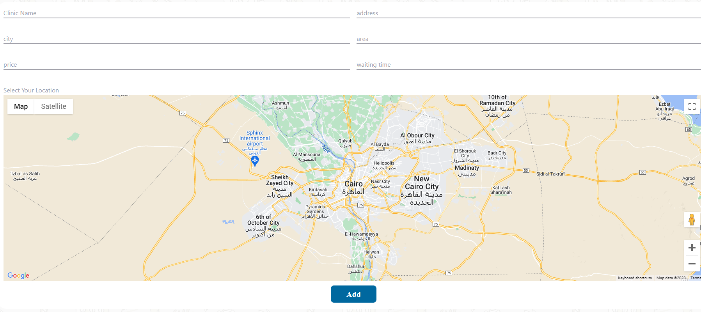
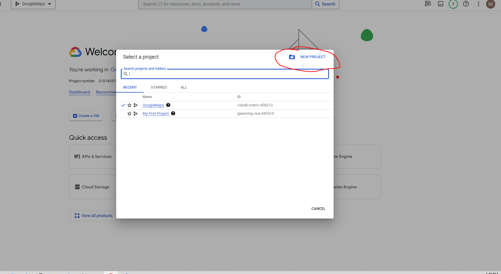
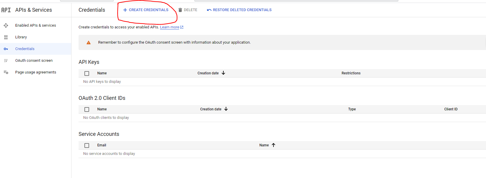
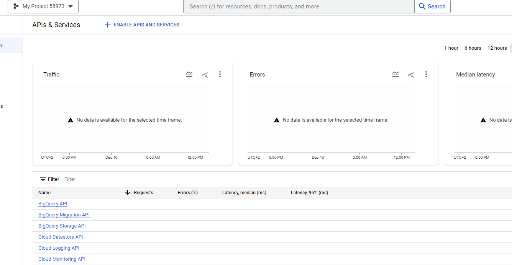
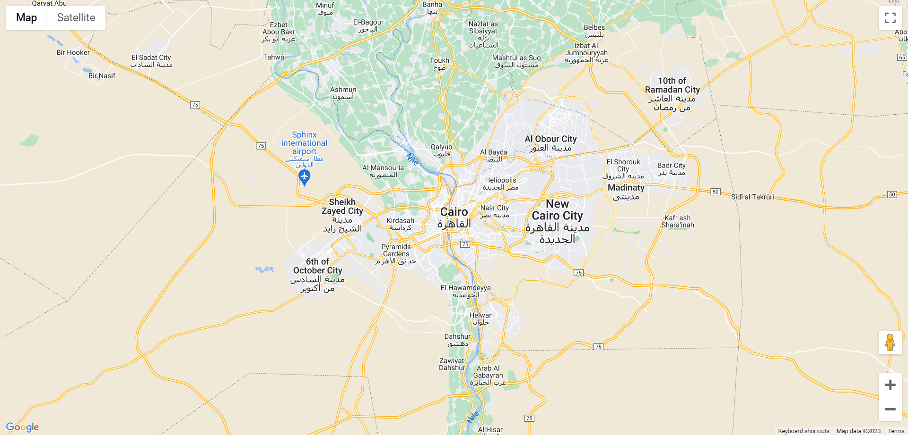
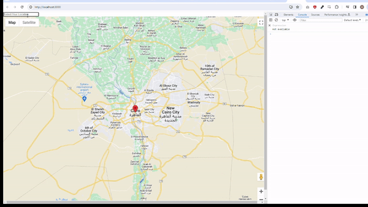

# Integrate Google Maps And AutoComplete Search With React

While working on one of my side projects, I've faced the challenge of integrating Google Maps into my application and allowing users to search for locations and add them to our database. I've named this feature "Select Your Location" in the form.



## Requirements

1. Set up a React Application: <br/>
   `npx create-react-app google-map-integration`
2. Google API key

   Note: Developer account on [Google Developer Console](https://console.cloud.google.com/) is required to access Maps JavaScript API

   - Login to your [Google Developer Console](https://console.cloud.google.com/) dashboard.
   - Create New Project.
     
   - Navigate to APIs & Services.
   - Then Credentials. Create Credentials.Select API Key
     

3. Maps JavaScript API

   - Go To Enable API & Services
   - Click Enable APIs And Services
     
   - Search for Maps JavaScript API, Places API, Geocoding API, and enable all of them.

   > Note: Maps JavaScript API is free to use but you need to set up a billing account to get rid of the limitations and watermark that comes with it.

4. [react-google-maps/api](https://www.npmjs.com/package/@react-google-maps/api) library

   `npm i @react-google-maps/api`

   We are going to use this library to render google maps and use maps APIs.

## Start Implementation

### Implementation Steps

1. Render basic Google Maps
2. Add Google Map default Marker.
3. Add places autocomplete search.
4. handle selected address and get it's lat,lng values.

#### Rendering Google Maps



Import GoogleMap, useLoadScript from [react-google-maps/api](https://www.npmjs.com/package/@react-google-maps/api) <br/>

1. Use 'useLoadScript' hook to load google maps api scripts.
2. GoogleMap Component to render Map itself or any others components related to maps.

Add Default rendering Google Map values this values are required

1. mapContainerClassName --> css class name that specifies height and width of maps.
2. center --> lat ,lng of center of the map in my case it's lat,lng for Cairo in Egypt.
3. zoom --> inital zoom of the map

**App.css**

```css
/* Container div height and width must be specified to run Maps Correctly */
.App {
  height: 100vh;
  width: 100vw;
}
.Map {
  height: 100vh;
  width: 100vw;
}
/* map container height and width to be provided to GoogleMaps Component */
.map_container {
  height: 100%;
  width: 100%;
}
```

**Map.js**

```javascript
import { GoogleMap, useLoadScript } from "@react-google-maps/api";

import "../App.css";

const Map = () => {
  const { isLoaded } = useLoadScript({
    googleMapsApiKey: process.env.REACT_APP_GOOGLE_API_KEY,
  });
  const center = { lat: 30.0444, lng: 31.2357 };
  return (
    <div className="Map">
      {!isLoaded ? (
        <h3>Loading.....</h3>
      ) : (
        <GoogleMap
          mapContainerClassName="map_container"
          center={center}
          zoom={10}
        />
      )}
    </div>
  );
};

export default Map;
```

**App.js**

```javascript
import "./App.css";
import Map from "./components/map";

function App() {
  return (
    <div className="App">
      <Map />
    </div>
  );
}

export default App;
```

### Add Marker To the Map

1. import Marker or MarkerF (for react 18+) from @react-google-maps/api
2. Add Marker compoent as child to map component.
3. specify marker position

```
import { GoogleMap, MarkerF, useLoadScript } from "@react-google-maps/api";

import "../App.css";

const Map = () => {
  const { isLoaded } = useLoadScript({
    googleMapsApiKey: process.env.REACT_APP_GOOGLE_API_KEY,
  });
  const center = { lat: 30.0444, lng: 31.2357 };
  const onLoadMarker = (marker) => {
    console.log("Marker", marker.position.lat);
  };
  return (
    <div className="Map">
      {!isLoaded ? (
        <h3>Loading.....</h3>
      ) : (
        <GoogleMap
          mapContainerClassName="map_container"
          center={center}
          zoom={10}
        >
          <MarkerF position={center} onLoad={onLoadMarker} />
        </GoogleMap>
      )}
    </div>
  );
};
export default Map;

```

#### Implementing Autocomplete Search

After reandring map now we are going to use Places API to using place auto complete feature.

> Note: You Need make sure enable Places API.

#### let's start

1. load places api when loading google maps scripts

   ```JavaScript
     const { isLoaded } = useLoadScript({
     googleMapsApiKey: process.env.REACT_APP_GOOGLE_API_KEY,
     libraries: ["places"],
   });
   ```

2. install use-places-autocomplete package

   `npm i use-places-autocomplete`

3. I'm going to use @reach/combobox as autocomplete component to view list of suggestion. **you can use your own input**.
   `npm i @reach/combobox`

4. import usePlacesAutocomplete hook
5. We are going to create new component to auto complete search PlacesAutoComplete component.

   ```JavaScript
   const PlacesAutoComplete = () => {
     const {
       ready,
       value,
       setValue,
       suggestions: { status, data },
       clearSuggestions,
     } = usePlacesAutocomplete({});

     return (
       <Combobox>
         <ComboboxInput
           value={value}
           onChange={(e) => setValue(e.target.value)}
           disabled={!ready}
           placeholder="Select Your Location"
         />
       </Combobox>
     );
   };
   ```

6. call usePlacesAutocomplete hook and get values:

   - **ready:boolean** --> The ready status of usePlacesAutocomplete.
   - **value:string** --> input value for the element.
   - **setValue:function** --> set value for input element.
   - **suggestions:Object{loading,status,data}** --> search result of Google Maps Places API.

     - **loading:boolean**--> status of api request is pending or completed.
     - **status:string** -->indicates status of the API Response on of these [values](https://developers.google.com/maps/documentation/javascript/reference/places-service#PlacesServiceStatus).
     - data:array --> array of suggestion [objects](https://developers.google.com/maps/documentation/javascript/reference/places-autocomplete-service#AutocompletePrediction).

   - **clearSuggestions**:Functin --> reset all values of suggestion Object.

7. Use combobox so we can use places api to search and get suggestion data.

   ```JavaScript
   const PlacesAutoComplete = () => {
     const {
       ready,
       value,
       setValue,
       suggestions: { status, data },
       clearSuggestions,
     } = usePlacesAutocomplete({});

     return (
       <Combobox>
         <ComboboxInput
           value={value}
           onChange={(e) => setValue(e.target.value)}
           disabled={!ready}
           placeholder="Select Your Location"
         />
         <ComboboxPopover>
           <ComboboxList>
             {status === "OK" &&
               data.map(({ description, place_id }) => (
                 <ComboboxOption key={place_id} value={description} />
               ))}
           </ComboboxList>
         </ComboboxPopover>
       </Combobox>
     );
   };
   ```

#### Handling Selected Locations

After using places Api to search for place and get suggestiong.<br>
we are going to use Geocoding API to get selected place lat,lng attributes

1. import getGeocode,getLatLng from use-places-autocomplete\

   ```JavaScript
   import usePlacesAutocomplete, {
   getGeocode,
   getLatLng,
   } from "use-places-autocomplete";
   ```

2. when user select address first we can pass parameter to set value which disable sending request to google apis.
3. clear suggestiong object.
4. call getLatLng with getGeocode result to get lat,lng of selected address

   ```JavaScript
      const handleSelect = async (address) => {
      setValue(address, false);
      clearSuggestions();
      const result = await getGeocode({ address }); //get geocoding object
      const { lat, lng } = await getLatLng(result[0]);
      console.log(`${address} Cordinates --> lat: ${lat} lng:${lng}`);
     };
   ```


